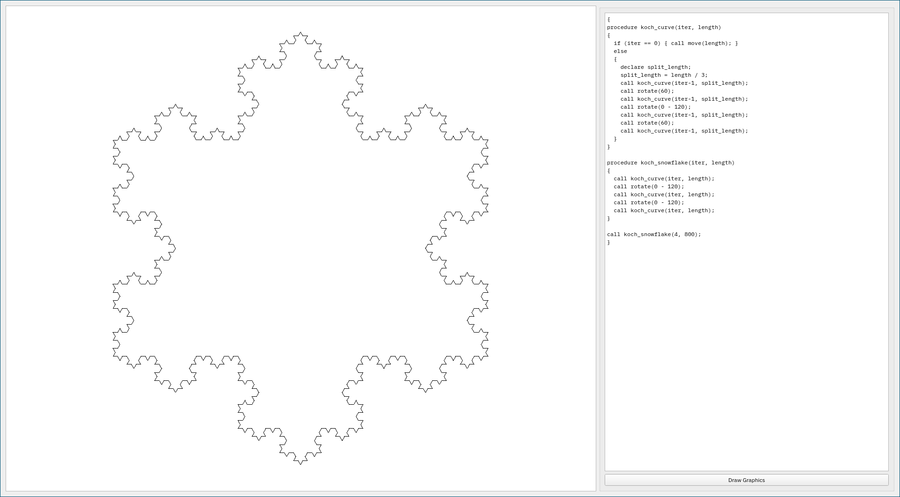

# TurtleGraphics

A simple GUI Application for drawing [turtle graphics](https://en.wikipedia.org/wiki/Turtle_graphics).

# Language

Drawing is done by specifying movement instructions on a pen which are written in a textbox. In addition, higher level control structures such as conditionals, loops and procedures are supported.

### Syntax
```
<program> ::= <block-statement>
<block-statement> ::= { <list of statements> }
<statement> ::= <declare-statement>
                | <assignment-statement>
                | <if-statement>
                | <while-statement>
                | <procedure-statement>
                | <call-statement>
                | <block-statement>
<declare-statement> ::= declare <comma-list of identifiers> ;
<assignment-statement> ::= <identifier> = <expression> ;
<if-statement> ::= if ( <bool-expression> ) <block-statement> else <block-statement>
<while-statement> ::= while ( <bool-expression> ) <block-statement>
<procedure-statement> ::= procedure <identifier> ( <comma-list of identifiers> ) <block-statement>
<call-statement> ::= call <identifier> ( <comma-list of expressions> ) ;

<bool-expression> ::= <expression> == <expression> | <expression> < <expression>
<expression> ::= <number> | <identifier> | ( <expression> ) | <expression> <operator> <expression>
<operator> ::= + | - | * | /
<number> ::= <integer> [ % <integer> ]
<identifier> ::= <alphabetic letter> <string of chars>
```
### Semantics

The semantics of statements are identical to their pendant in other languages such as C or Java. Drawing is done by calling one of the following prebuilt procedures:
| Identifier    | Description                 |
| :-----------: | :-------------------------- |
| pen\_up()     | lift pen                    |
| pen\_down()   | lower pen                   |
| move(x)       | move pen by x units         |
| rotate(x)     | rotate pen by x units       |

Rationals are the only supported data type where the optional denominator is separated by '%' from the numerator.

# Building
 
 To build the project you need
  * C++17 compatible compiler
  * CMake 3.16.0+
  * Qt5

# Images
 
